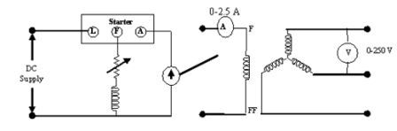
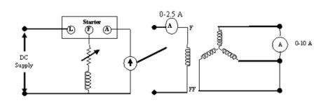
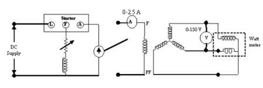
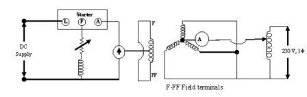

# Theory and Procedure of the Experiment - 3

## A. Determination of Positive Sequence Reactance (X₁)

A system component operating under balanced condition of voltage and current is in effect in a positive sequence mode. The positive sequence reactance X₁ of a synchronous machine under steady state condition is the direct axis synchronous reactance Xd of the machine. The positive sequence impedance can also be defined as the impedance offered by the machine to the flow of positive sequence currents in the armature windings create a rotating magnetic field. The positive sequence reactance can be calculated by the expression:

X₁ = E / Isc

where E and Isc are No load armature voltage and short circuit armature current respectively.

### 1. Open Circuit Test

a. Run the machine at rated speed.  
b. Connect a voltmeter and ammeter according to the [open circuit diagram](#open-circuit-diagram).  
c. Note the readings for different exciting currents.

### 2. Short Circuit Test

a. Make the connections as shown in [Short circuit diagram](#short-circuit-diagram).  
b. Run the machine at rated speed.  
c. Apply low voltage to the field circuit so that exciting current is small. Alternately connect a high resistance in the field circuit with full applied voltage.  
d. Apply three-phase short circuit at the synchronous machine terminal with an ammeter connected in any phase.  
e. Measure the short circuit current corresponding to the field current.

---

## B. Determination of Negative Sequence Reactance (X₂)

The negative sequence reactance X₂ can be obtained by running the machine at rated speed with a low excitation and with a sustained two phase short circuit between the open phase and any short circuited phase. Let open circuit voltage be Vos and the short circuit current Isc. The negative sequence impedance Z₂ and reactance X₂ can be calculated using the following expressions:

Z₂ = Vos / (3 · Isc)

X₂ = Z₂ · sin φ

φ = cos⁻¹(P / (Vsc · Isc))

**Procedure:**

a. Make the connections as shown in [figure for determining X₂](#diagram-for-determination-of-x₂).  
b. Run the machine at rated speed.  
c. Short circuit two phases of the alternator through an ammeter and the current coil of the wattmeter.  
d. Connect the voltage coil of the wattmeter and the voltmeter between the open phase and any short circuited phase.  
e. Gradually increase the excitation such that the short circuit current does not exceed its rated value.  
f. Note the reading of voltage, current and power.

---

## C. Determination of Zero Sequence Reactance (X₀)

The machine is driven at rated speed. Connect all three phases in parallel and the voltmeter and ammeter according to the [figure for determining X₀](#diagram-for-determination-of-x₀).

**Procedure:**

a. Connect the armature winding in parallel according to the circuit diagram.  
b. Run the machine at rated speed.  
c. Apply low voltage from a variac and measure both voltage V₀ and current I₀ taken by the armature windings. Zero sequence reactance can be calculated using the following expression:

X₀ = 3 · Z₀ / I₀

---

## Diagrams

### Open circuit Diagram

Fig 3.1 Connection Diagram for open circuit

---

### Short circuit Diagram

Fig 3.2 Connection Diagram for short circuit

---

### Diagram for Determination of X₂

Fig 3.3 Connection Diagram for Determination of X₂

---

### Diagram for Determination of X₀

Fig 3.4 Connection Diagram for Determination of X₀

